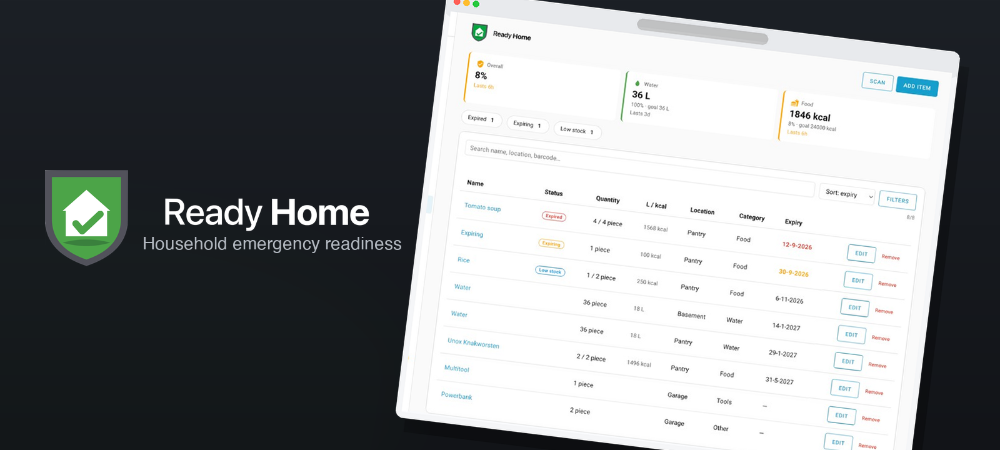

# Ready Home for Home Assistant

Track household emergency supplies, measure readiness against water and calorie targets, and surface expired, expiring, and low-stock items as Home Assistant sensors, events, and a sidebar management panel.

## Features

- **Inventory** — Items with quantity, desired quantity, expiry, priority, location, and category
- **Readiness** — Water (liters) and food (calories) on-hand vs per-person targets over a configurable duration (default 72 hours)
- **Sensors** — Overall / water / food readiness %, expired / expiring / low-stock counts, total items, needs-attention binary sensor
- **Actions** — `add_item`, `update_item`, `adjust_quantity`, `remove_item`, `list_items`, `lookup_barcode`
- **Events** — `ready_home_item_expired`, `ready_home_item_expiring`, `ready_home_item_low_stock` (fire once on transition)
- **Sidebar** — Ready Home panel for full inventory management
- **Barcode** — Open Food Facts lookup via action, websocket, or sidebar panel. Camera scan uses the Home Assistant Companion app; on desktop enter the code and tap Lookup

## Screenshots

   
  <em>Mobile panel — readiness cards and inventory list</em>

   
  <em>Add / edit item — barcode lookup, stock, calories, expiry</em>

   
  <em>Home Assistant sensors — readiness %, expired, expiring, low stock</em>

## Install

Installable through [HACS](https://hacs.xyz/) as a **custom repository** (category: **Integration**). Default-store listing is pending.

1. HACS → Integrations → ⋮ → **Custom repositories**
2. Add this repository URL, category **Integration**
3. Install **Ready Home**, then restart Home Assistant
4. Settings → Devices & Services → Add Integration → **Ready Home**
5. Enter the number of people in the household

Full guide: [1. Installation](docs/01-installation.md) · [2. Configuration](docs/02-configuration.md) · [3. Usage](docs/03-usage.md)

## Documentation

1. [Installation](docs/01-installation.md)
2. [Configuration](docs/02-configuration.md)
3. [Usage](docs/03-usage.md)
4. [Actions](docs/04-actions.md)
5. [Sensors and events](docs/05-sensors-and-events.md)
6. [Automations](docs/06-automations.md)
7. [Readiness math](docs/07-readiness.md)

## License

[MIT](LICENSE)
