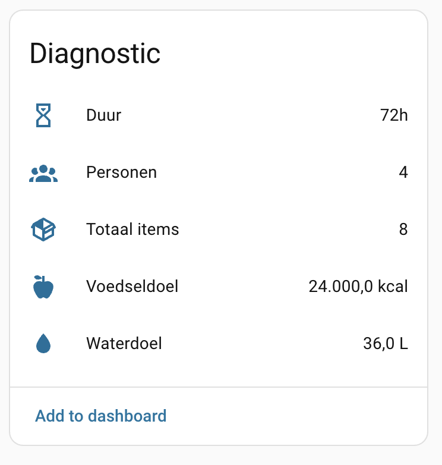

# 5. Sensors and events

## Sensors

Ready Home exposes entities such as:

- Overall / water / food readiness %
- Expired / expiring / low-stock counts
- Total items
- Needs-attention binary sensor

Diagnostic attributes (people, duration, targets, totals) are also available on the device:

## Events

These fire once on transition:

- `ready_home_item_expired`
- `ready_home_item_expiring`
- `ready_home_item_low_stock`

See [6. Automations](06-automations.md) for examples.

---

**Previous:** [4. Actions](04-actions.md) · **Next:** [6. Automations](06-automations.md)
