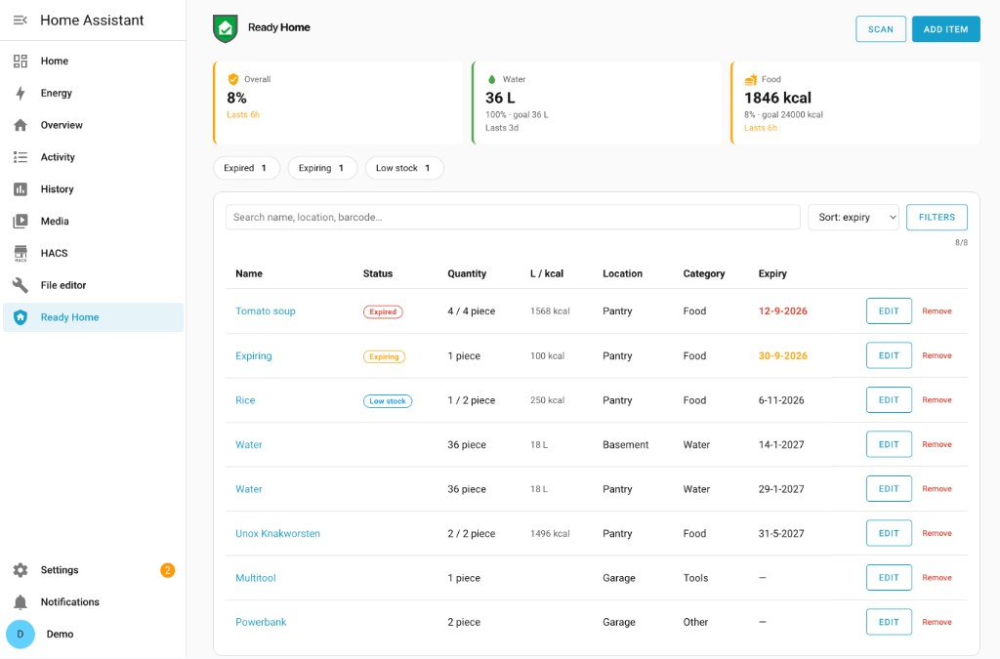
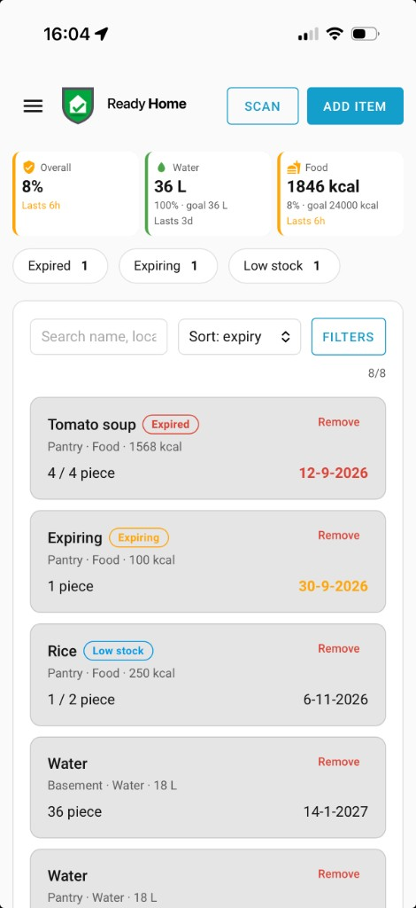
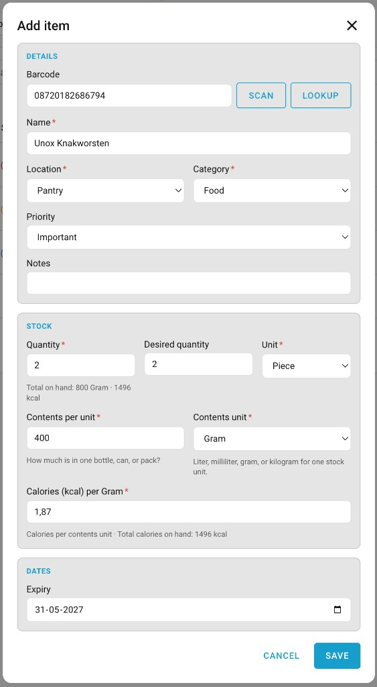
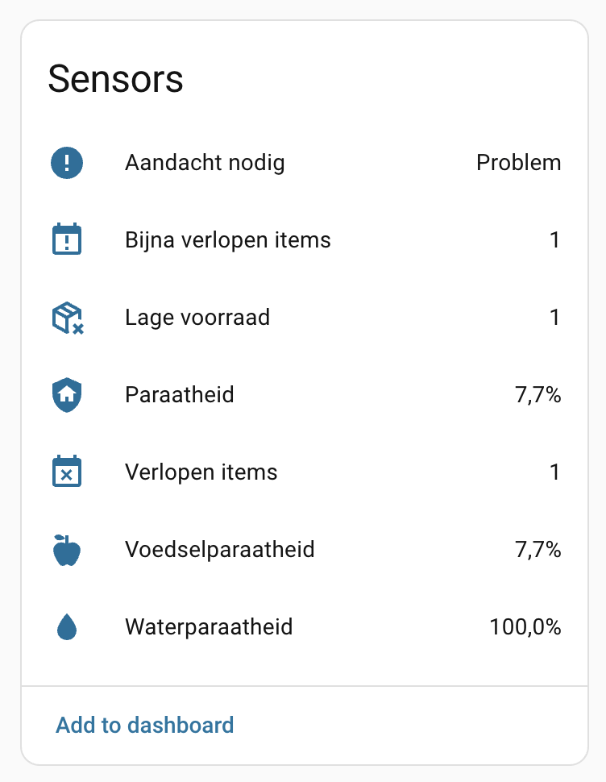

# Usage

After [installation](installation.md), open **Ready Home** in the Home Assistant sidebar.

## Sidebar panel

The panel shows:

- Readiness cards (overall, water, food)
- Filters for expired, expiring, and low-stock items
- Search, sort, and filters
- Full inventory list with edit / remove

## Add and edit items

Use **Add item** (or **Edit** on a row). You can set quantity, desired quantity, location, category, priority, contents (liters/calories), and expiry.

## Barcode

- **Desktop:** enter a barcode and tap **Lookup** (Open Food Facts).
- **Companion app:** use **Scan** with the device camera when available.

Lookup is also available via the `ready_home.lookup_barcode` [action](actions.md).

## Sensors

Readiness and attention counts appear as Home Assistant entities on the Ready Home device. See [Sensors and events](sensors-and-events.md).

